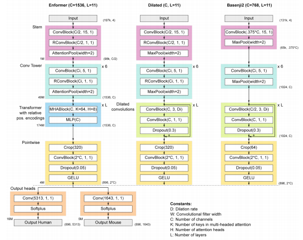

</img>

## Enformer - Pytorch

Implementation of <a href="https://deepmind.com/blog/article/enformer">Enformer</a>, Deepmind's attention network for predicting gene expression, in Pytorch. The original tensorflow sonnet code can be found <a href="https://github.com/deepmind/deepmind-research/tree/master/enformer">here</a>.

## Install

```bash
$ pip install enformer-pytorch
```

## Usage

```python
import torch
from enformer_pytorch import Enformer

model = Enformer(
    dim = 1536,
    depth = 11,
    heads = 8,
    output_heads = dict(human = 5313, mouse = 1643),
    target_length = 896,
)

seq = torch.randint(0, 4, (1, 196_608)) # for AGCT
output = model(seq)

output['human'] # (1, 896, 5313)
output['mouse'] # (1, 896, 1643)
```

You can also directly pass in the sequence as one-hot encodings, which must be float values

```python
import torch
import torch.nn.functional as F
from enformer_pytorch import Enformer

model = Enformer(
    dim = 1536,
    depth = 11,
    heads = 8,
    output_heads = dict(human = 5313, mouse = 1643),
    target_length = 896,
)

seq = torch.randint(0, 4, (1, 196_608))
one_hot = F.one_hot(seq, num_classes = 4).float()

output = model(one_hot)

output['human'] # (1, 896, 5313)
output['mouse'] # (1, 896, 1643)
```

Finally, one can fetch the embeddings, for fine-tuning and otherwise, by setting the `return_embeddings` flag to be `True` on forward

```python
import torch
import torch.nn.functional as F
from enformer_pytorch import Enformer

model = Enformer(
    dim = 1536,
    depth = 11,
    heads = 8,
    output_heads = dict(human = 5313, mouse = 1643),
    target_length = 896,
)

seq = torch.randint(0, 4, (1, 196_608))
one_hot = F.one_hot(seq, num_classes = 4).float()

output, embeddings = model(one_hot, return_embeddings = True)

embeddings # (1, 896, 3072)
```

For training, you can directly pass the head and target in to get the poisson loss

```python
import torch
import torch.nn.functional as F
from enformer_pytorch import Enformer

model = Enformer(
    dim = 1536,
    depth = 11,
    heads = 8,
    output_heads = dict(human = 5313, mouse = 1643),
    target_length = 200,
).cuda()

seq = torch.randint(0, 4, (196_608 // 2,)).cuda()
target = torch.randn(200, 5313).cuda()

loss = model(
    seq,
    head = 'human',
    target = target
)

loss.backward()

# after much training

corr_coef = model(
    seq,
    head = 'human',
    target = target,
    return_corr_coef = True
)

corr_coef # pearson R, used as a metric in the paper
```

## Todo

- [x] script to load weights from trained tensorflow enformer model to pytorch model
- [ ] add loss wrapper with poisson loss
- [ ] move the metrics code over to pytorch as well
- [ ] train enformer model

## Citations

```bibtex
@article {Avsec2021.04.07.438649,
    author  = {Avsec, {\v Z}iga and Agarwal, Vikram and Visentin, Daniel and Ledsam, Joseph R. and Grabska-Barwinska, Agnieszka and Taylor, Kyle R. and Assael, Yannis and Jumper, John and Kohli, Pushmeet and Kelley, David R.},
    title   = {Effective gene expression prediction from sequence by integrating long-range interactions},
    elocation-id = {2021.04.07.438649},
    year    = {2021},
    doi     = {10.1101/2021.04.07.438649},
    publisher = {Cold Spring Harbor Laboratory},
    URL     = {https://www.biorxiv.org/content/early/2021/04/08/2021.04.07.438649},
    eprint  = {https://www.biorxiv.org/content/early/2021/04/08/2021.04.07.438649.full.pdf},
    journal = {bioRxiv}
}
```
